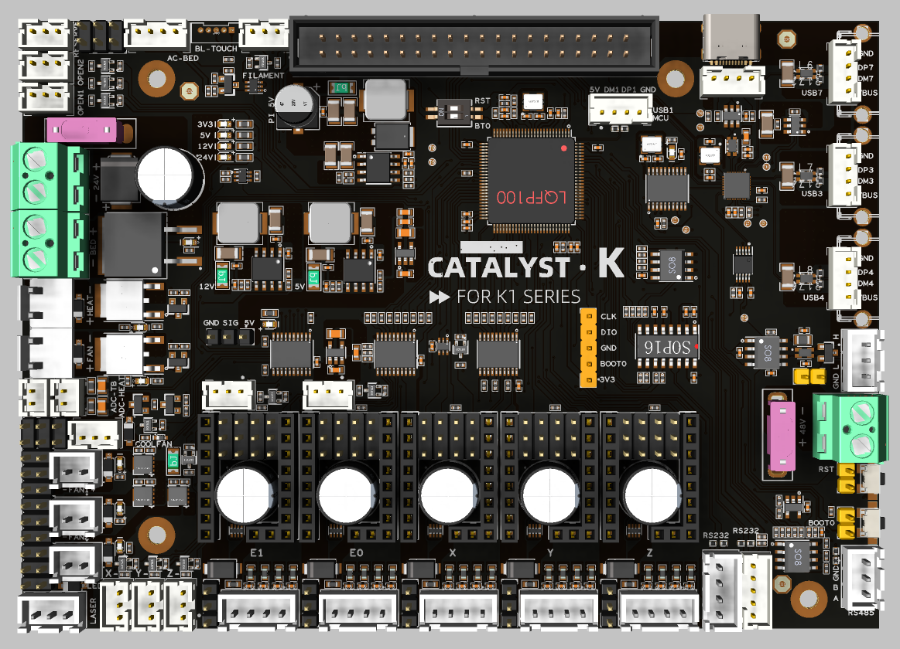
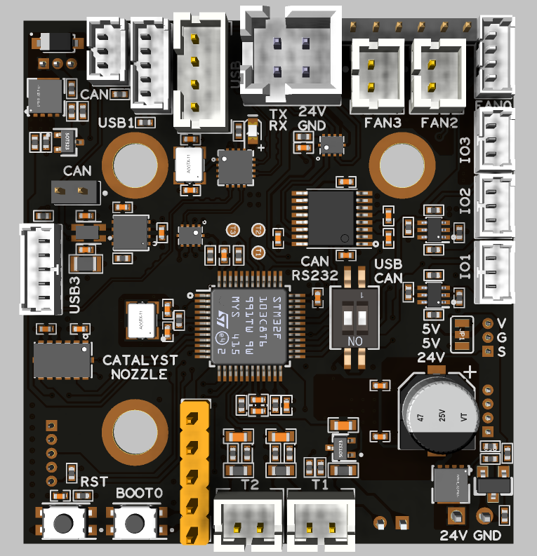
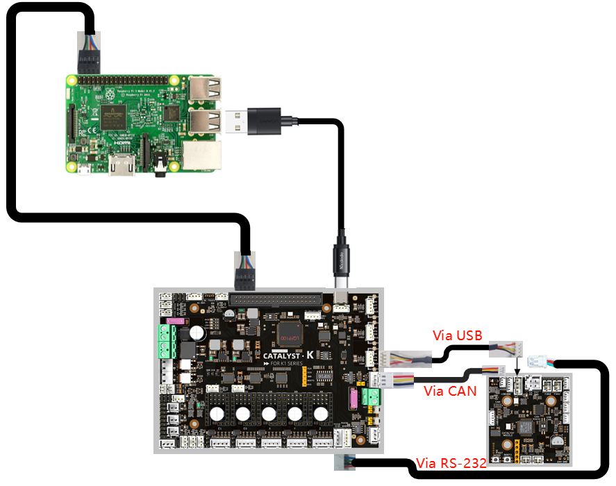

# Catalyst.K

# Introduction
This high‑performance 3D printer mainboard is built around an STM32H723 32‑bit MCU and comes in a 138 mm × 98 mm form factor. Designed for modern open‑source firmware such as Klipper, it connects to external SBCs like Raspberry Pi 3B+/4B/5B via USB to form a powerful “MCU + SBC” architecture, enabling high‑speed printing, multi‑axis motion control, and advanced feature expansion.

# Features
- High‑performance MCU based on STM32H723 for demanding 3D printing workloads such as high‑speed interpolation and synchronized multi‑axis motion control.
- Native support for Klipper‑style setups via USB connection to Raspberry Pi 3B+/4B/5B or any Klipper‑compatible host.
- Five STEPSTICK sockets supporting flexible driver choices such as TMC5160 and TMC2209 to balance torque, smoothness, and silent operation.
- Selectable 24V/48V stepper motor supply with per‑motor voltage selection for mixed‑voltage motion systems.
- DC 24V input with 24V/10 A heated bed output, AC bed control signal output, and up to 5A hotend heater output for high‑power applications.
- On‑board regulated rails: 12V/3A, 5V/3A, 5V/6A (for Raspberry Pi power), and 3.3V/800 mA to power fans, sensors, and SBCs from a single board.
- Rich connectivity including 3× USB, 2× RS‑232, 1× RS‑485, and 1× high‑speed CAN interface for advanced expansions and distributed motion systems.
- Nine general‑purpose IOs and five fan outputs, with four voltage‑selectable (5V/12V/24V), plus an RGB header for status indication and lighting effects.

-------

# Applications
- Ideal as the main controller for mid‑ to high‑end FDM 3D printers, especially Klipper‑based high‑speed and multi‑axis systems.
- Suitable for upgrading existing printers from legacy 8‑bit or low‑performance boards to an STM32H7 + Klipper platform for higher speed and greater flexibility.
- Can be used in other motion‑control equipment requiring up to five stepper axes, 24 V / 48 V mixed supplies, and rich communication interfaces, such as small CNC machines, automation rigs, and laboratory devices.

# Catalyst.K ToolHead

# Introduction

CATALYST_NOZZLE is a compact Klipper toolboard with a footprint of only 47 mm × 44 mm, designed to be mounted close to the printhead or extruder. It is powered by an STM32G431CBT6 32‑bit MCU and supports multiple communication modes, including USB and CAN / RS‑232, which can be switched via an on‑board physical button.
The board integrates a TMC2209 stepper motor driver, an ADXL345 3‑axis accelerometer, multiple fan and temperature inputs, as well as BL‑Touch and hotend heater control. This greatly simplifies toolhead wiring, reduces cable bundle weight on moving parts, and improves overall reliability and serviceability of the printer.

# Features 
- Compact toolboard design: 47 mm × 44 mm, mounted directly near the printhead or extruder to greatly simplify wiring.
- STM32G431 MCU: 32‑bit high‑performance controller optimized for Klipper multi‑MCU setups.
- Multiple communication modes: Supports USB, CAN, and RS‑232, switchable via on‑board button.
- On‑board USB hub: Provides 3× USB ports and 1× CAN port for easy host and expansion connectivity.
- Integrated TMC2209: On‑board 24V‑powered TMC2209 stepper driver for silent, precise extruder control.
- Built‑in ADXL345: On‑board 3‑axis accelerometer for Klipper input shaping and resonance testing.
- Stable power outputs: 24V input (max. 28V) with on‑board 5V@3A and 3.3V@0.8A rails.
- Rich IO and fan interfaces: 4 level‑shifted IO pins, 4 fan outputs (2×2‑wire with selectable 5V/24V, 1×3‑wire, 1×4‑wire).
- Complete sensing and actuator interfaces: 3 temperature inputs, 1 BL‑Touch connector, 1 hotend heater output up to 2.5A.
- Easy debugging: On‑board BOOT0 and RESET buttons for quick flashing and debugging.

# Applications 
- Used as a Klipper toolhead board for extruder/printhead control, providing local motor drive, temperature control, fan control, and acceleration measurement on the toolhead to greatly simplify the printer’s wiring.
- Suitable for mid‑ to high‑end FDM 3D printers that require integrated TMC2209, ADXL345, BL‑Touch, and multiple fan/temperature interfaces, both for upgrading existing machines and for new printer designs.
- Applicable in multi‑toolhead, multi‑nozzle, or remote‑extrusion setups as a distributed toolboard node, connected to the Klipper host system via CAN or USB /RS‑232 to build flexible multi‑MCU motion control architectures.

# Communication

# Reference
Catalyst.K:https://wiki.fysetc.com/docs/MNT9Vlou?preview=1

Catalyst.K ToolHead:https://wiki.fysetc.com/docs/Yo6J22mg?preview=1